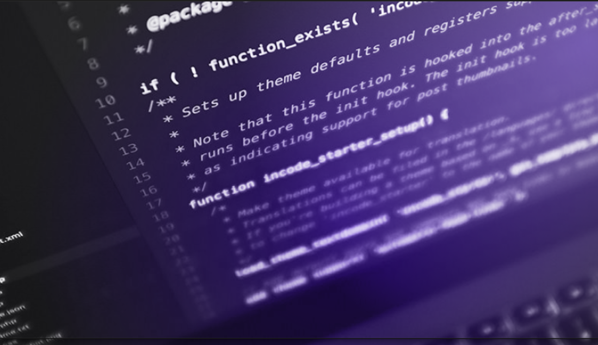

  
  
  
  
  
  
	
  
  
  

  

# Clean Code Desafios

## ✒️ Descrição
ste repositório foi criado para resolver os nove desafios do curso de Clean Code da Rocketseat, aplicando os princípios de código limpo, como clareza e simplicidade, em diferentes problemas propostos ao longo do curso.

## 🚀 Tecnologias utilizadas

 

  

  

## 📷 Demostração
Apresentação da tela do aplicativo.

  

## 🔥 Instalação
Clone o repositório.
~~~
git clone https://github.com/vian4dev/clean-code-desafios.git
~~~
Acesse o diretório do projeto.
~~~
cd clean-code-desafios/
~~~
Acesse os códigos do desafio.
~~~
code .
~~~

## 📝 Licença
Esse projeto está sob a licença MIT. Veja o arquivo [LICENSE](LICENSE) para mais detalhes.

---

 
 
Desenvolvido por - <a href="https://github.com/vian4dev">Gabriel Viana</a> 🤖

 
  

